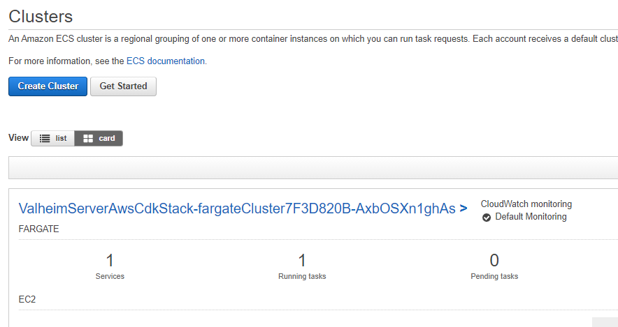
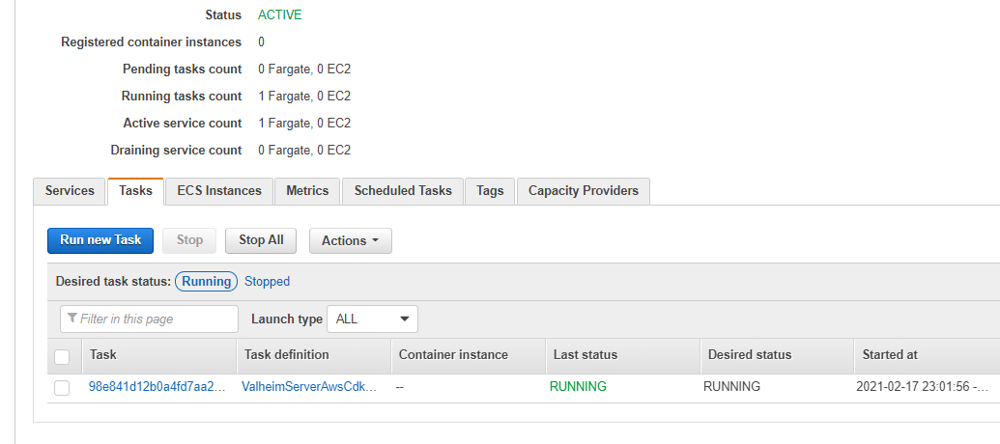
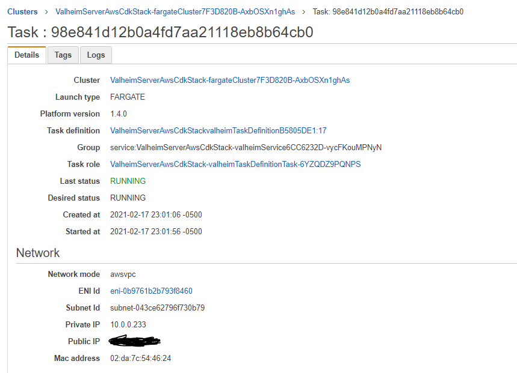

# valheim-ecs-fargate-cdk


This is a CDK Project for spinning up a [Valheim](https://store.steampowered.com/app/892970/Valheim/) game server on AWS Using [ECS Fargate](https://aws.amazon.com/fargate/?whats-new-cards.sort-by=item.additionalFields.postDateTime&whats-new-cards.sort-order=desc&fargate-blogs.sort-by=item.additionalFields.createdDate&fargate-blogs.sort-order=desc) and [Amazon EFS](https://aws.amazon.com/efs/)!

Uses [valheim-server-docker](https://github.com/lloesche/valheim-server-docker) - thanks to lloesche for putting it together!

## Table of Contents
- [Installation](#installationdeployment)
- [Configuration](#configuration)
- [Cost Information](#solution-cost-information)
- [FAQ](#common-problemsfaq)
  * [Find your server IP](#how-do-i-find-the-ip-of-my-server)

## Installation/Deployment

Making the assumption you have an AWS Account Already and a valid set of creds configured:

1. Create a Secret named **valheimServerPass** in the same region you plan to deploy the CDK Stack - we reference it by name [here](lib/valheim-server-aws-cdk-stack.ts#L14-17) and pass that value to our container as a secret. valheim-server-docker requires this to be AT LEAST 5 characters (ideally much more). The secret string should be a key value pair as below:

```bash
aws secretsmanager create-secret --name valheimServerPass --secret-string '{"VALHEIM_SERVER_PASS":"SuperSecretServerPassword"}'
```

2. Clone down our source code:

```bash
git clone git@github.com:rileydakota/valheim-ecs-fargate-cdk.git && valheim-ecs-fargate-cdk
```

3. Install dependencies:

```bash
npm i
```

4. Setup the config

```bash
cp .env.example .env
```

5. Decide if you want the optional AWS App gateway lambda endpoints to start and stop your server and get the server status. If you do, then change `APPGW_START_STOP_PASSWORD` in `.env`.

6. Assuming you have already bootstrapped your account via the CDK (see [here](https://docs.aws.amazon.com/cdk/latest/guide/bootstrapping.html) if not) - deploy the stack

```
npx cdk deploy --all
```

6. enjoy accidentally chopping trees onto your friends powered by AWS!

## Configuration

### Valheim Server
If you want to configure the Valheim server, then you can do so in `.env`. Environment variables with the `VALHEIM_DOCKER_` prefix will be used in the environment we run the docker image in. 

To see a full list of possible environment variables, see [valheim-server-docker#environment-variables](https://github.com/lloesche/valheim-server-docker#environment-variables)

### Bootstrapping with existing world

1. This must be a fresh depoyment. If `/config/worlds_local/` exists in the container, then we will not copy the files from S3 into the docker container.
1. Create a ZIP file of your existing world.
  * This MUST follow the folder structure at the bottom of the steps.
  * The name of this ZIP file MUST match the BOOTSTRAP_WITH_WORLD_NAME environment variable (in `.env`).
1. Update `BOOTSTRAP_WITH_WORLD_NAME` in `.env` to the same filename. 
1. Deploy `npx cdk deploy --all`
1. After depoying, double check and make sure that the world was loaded and it didn't error and create a new one.
  * I would check for something like`Load world: MyCoolValheimServer (MyCoolValheimServer)`
  * If this was a world from a previous version, then you should see a lot of `Old location found ...` messages.

ZIP archive structure:
```
# kayo @ ClockTower in ~/workspace/valheim-ecs-fargate-cdk on git:bootstrap-world o [22:02:46] 
$ unzip -l resources/worlds/valheim_backup_2023-01-08T09_26_00_00.zip
Archive:  resources/worlds/valheim_backup_2023-01-08T09_26_00_00.zip
  Length      Date    Time    Name
---------  ---------- -----   ----
       39  2021-02-13 18:16   adminlist.txt
       40  2021-02-13 18:16   bannedlist.txt
       42  2021-02-13 18:16   permittedlist.txt
      217  2021-02-12 20:26   Player-prev.log
      217  2021-02-12 20:28   Player.log
      218  2023-01-02 23:39   prefs
        0  2023-01-08 20:52   worlds_local/
 69646068  2022-11-28 12:04   worlds_local/MyCoolValheimServer.db
       44  2022-11-28 12:04   worlds_local/MyCoolValheimServer.fwl
---------                     -------
141326454                     13 files
```

## Solution Cost Information

Coming soon

## Common Problems/FAQ

### Accessing the docker container

This assumes that you either have credentials that give you admin roles or have setup an IAM role with the required permsissions.

```bash
aws ecs execute-command 
  --region <REGION> \
  --cluster <YOUR_CLUSTER_NAME_GOES_HERE_CHANGEME> \
  --task <YOUR_TASK_ID_GOES_HERE_CHANGEME>  \
  --command "/bin/bash" \
  --interactive
```

Now you should have an interactive shell you can use to explore the container.

### How do I find the IP of my server?

#### Via the ecs-cli:

Install the ecs-cli by running the following (this assumes Linux - for other environments see [here](https://docs.aws.amazon.com/AmazonECS/latest/developerguide/ECS_CLI_installation.html))

```bash
sudo curl -Lo /usr/local/bin/ecs-cli https://amazon-ecs-cli.s3.amazonaws.com/ecs-cli-linux-amd64-latest
sudo chmod +x /usr/local/bin/ecs-cli
```

Using the Cluster Name outputted by successfully running the CDK template - run the following command:

```bash
ecs-cli ps --cluster YOUR_CLUSTER_NAME_GOES_HERE_CHANGEME
```

You will be presented with the public ip of your server as follows:

```bash
Name                                                                                                            State    Ports                                                                                     TaskDefinition                                            Health
ValheimServerAwsCdkStack-fargateCluster7F3D820B-AxbOSXn1ghAs/8d190269c9df4d3e9709dccb89bdf3d8/valheimContainer  RUNNING  1.1.1.1:2456->2456/udp, 1.1.1.1:2457->2457/udp, 1.1.1.1:2458->2458/udp  ValheimServerAwsCdkStackvalheimTaskDefinitionB5805DE1:17  UNKNOWN
```

Game server runs on port 2456 (unless changed)

#### Via the AWS Console: 
goto the ECS Service page (click the services dropdown and select ECS - or click [here](https://us-east-2.console.aws.amazon.com/ecs) if you are in us-east-2). From here - you will see a Cluster listed. Click the cluster name to continue to the details page.


At the bottom half of the screen - click the Tasks tab tab - you should see a "Task ID". Click the task id to continue to the next page.


Finally - the public IP of your server will be listed here - under the Network section. Connect to the server using the IP and port 2456!


---

## To-Do

Coming soon
